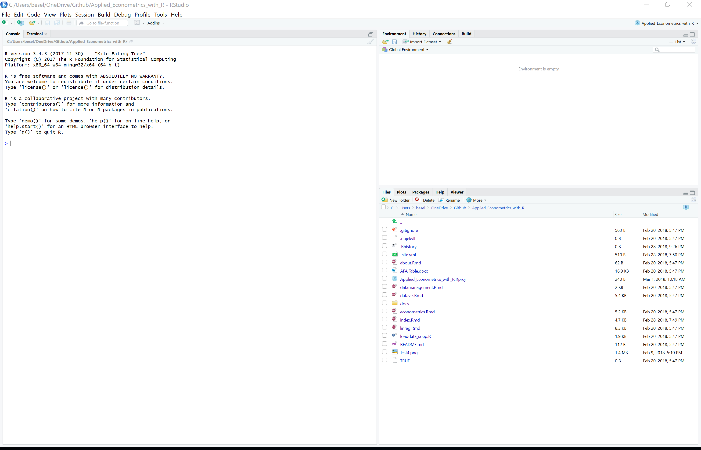

```{r setup, include=FALSE}
knitr::opts_chunk$set(echo = TRUE)
```
***
# Hello

Hi everyone from Benedikt and Marcel and welcome to this introductory **Applied Econometrics with R** tutorial. The following paragraphs shall get you familiar with R and hopefully make you full-fledged data scientists in no time. So let's get started. 

R is a powerful prgramming language that is expecially well-suited for statistical analyses and the creation of graphics. It is one of the most widely used software packages in Econometrics and Applied Statistics.
It is free and constantly adjusted and extended by a large user community which is why it is always up to date when it comes to the latest statistical developments. 


*****
# Technical Set-Up
***
## Installation
R is the software executing your commands 

BUT: R itself is not quite userfriendly - the pane is inconvenient to maneuver. Therefore, there are various interfaces that can be added on top on the plain R. 
The most common one is R-Studio. 


**Download R**: 

[MACOSX](https://cran.rstudio.com/bin/macosx/)

[Windows](https://cran.r-project.org/bin/windows/)


**Download R Studio**: 

[Link](https://www.rstudio.com/products/rstudio/download/)


**Trouble Shooting**

If you have any problems with the installation process follow these pages

[MACOSX](https://www.r-bloggers.com/installing-r-on-os-x/)

[Windows](https://www.r-bloggers.com/download-and-install-r-in-windows/)


***
## First Step
After having succesfully installed R and R-Studio open RStudio (*never open R directly, always access it through RStudio*), you should see something like this: 


The big one on the left is called *Console* and it is the plain R execution window: 
You can type single lines of code in there and they are executed immediately after pressing Enter. 

On the right hand side you see the *Envivonment*. The Environment  is just a place to store variables – a set of bindings between symbols and objects. If you start up R and make an assignment, you're adding an entry in the global environment (we'll come back to that shortly) 

On the lower lefthand side various informations about your current project can be retrieved (amongst them the Help section which explains functions). Also plots can be given a first view in that part. 


***
## Working Directories/PROJECTS
Always use projects - they make your life much easier.
RStudio projects make it straightforward to divide your work into multiple contexts, each with their own working directory, workspace, history, and source documents.

It is - espcecially in the beginning - the most convenient way to source all your data (and scripts) at one place. Important: **You need to designate one folder in your explorer system within which everything related to your very first project is safed.** 

To create a new project use the Create Project command (available on the Projects menu and on the global toolbar). 
Press: New Directory 

This creates a project file (with an .Rproj extension) within the project directory. You can use this file in your folder as a shortcut to open the project.

When you simply quit a project by clsing RStudio or the project directly all files, code, .RData and RStudio settings are saved. 

***
# TaschenrechneR 1
Ok - by now we have invested a lot of time potentially doing nothing else but setting up stuff we have no use for. Can't we get startetd right a way?

Of course - let's do some calculations.
Type the following into the Console:
```{r}
1+1 #What might be the result
# Hashtags tell R that everything in the same line behind them should not be run by the programm.
```

Wow - by now we know that R has the same power as a very simple calculator. 
As every simple calculator, you can write only one line of code at once and cannot save anything in a larger context. This is of course problematic because we will want R to execute larger chunks of code.
If we would want to multiply 1+1 in a next step by two and then in a third step divide it by four, we would have to write everything in the only available calculator line.
There must be a better way around this.

***
# R Scripts
Of course there is - RScripts!
An RRScript contains all commands including those for reading the reaw data, data manipulation, estimation, post-estimation analyses, and the creation of graphs and tables. We can ask R to run all or some ot the commands listed in the R script at once. 
This is key becaus the key feature of every scientific methods is reproducibility. When relying on R Scripts we can backtrack all the changes we made to our data and the assumptions we were relying on in our analysis with a simple mouse click. 

To open the editor for creating a new R script click on the symbol in the top left corner and choose open a new R script. Be sure to save it in the same folder where also your RProject is saved. 

As discovered above, the # Symbol is extremely useful because thereby we can comment on stuff without our comments being evaluated by R. 

Given an R script, we can send lines of code to R to be evaluated. To run the line in which the cursor is, press **Ctrl+Enter**. To run several lines of code, mark them with the mouse and do the same. 

Try it out with running the following code at once:
```{r}
1+1
5+(4-1)^2
# Let's try some Count Zeppelin
# Man muß nur wollen und daran glauben, dann wird es gelingen. # This doesn't work because R doesn't know this text
#But R does know text. Text which R knows is called a function. Very intuitive functions are:
sqrt(4)
log(10)

```


***
# Packages
One more thing...
R itself can operate only very basic tasks. Even you as a novice will soon discover that you need extensions to run your stuff. This extensions are called packages. They are developed by the large R users community and for free, too. If they meet certain quality criteria, they are published on the official "Comprehensive R Archive Network" (CRAN). 
You only have to install packages once on your computer - all you need is a simple line of code. 
```{r eval=FALSE}
install.packages("package name")
# But installing a project implies just that you have saved it on your computer.
# To make it useable for your session you still have to open it every time (e.g. you need the following line in your script:)
library(packagename)
```

Let's introduce only one small package for now to understand the package functionality. 
The pipe %>% operator from the magrittr package (which in turn is part of the [tidyverse](https://www.tidyverse.org/))


``` x %>% f(); x %<>% f() {magrittr}```	
The Pipe operator from the magrittr package pipes the last element of something into the first one of the next.  
```x %>% f()``` .
```{r}
# Lets say we want to collect many numbers, perhaps all numbers from 1 to 5.
# How do we do that? With a vector.
# You can tell R to collect numbers in a vector with c(number, number, number)
c(1,2,3,4, 5)
# A cooler way to write this is:
c(1:5)

# Now lets say, we want to get the mean from that list
mean(c(1:5))

# And here comes the power of the pipe:
# install.packages(magrittr)
library(magrittr)
c(1,2,3,5) %>% mean()
```	

# Style

Maybe here short intro into R style or link to google style sheet. 

# Important Ressources
[Stackoverflow](https://www.stackoverflow.com/))
A general discussion forum for programmers, including many R users.
Just google your question and make sure to place an "R" in the beginning of your question. Most often you will be directed to stackoverflow.

[Econometrics for R](http://www.urfie.net/)
Great book - this class is mainly based upon it.
Has some 60pages of introduction into R.

[CodeSchool](http://tryr.codeschool.com/)
A fun way to learn the basics of R. 

[Cheat Sheet Base R](https://www.rstudio.com/wp-content/uploads/2016/05/base-r.pdf)
A concise overview over the base R logic.

